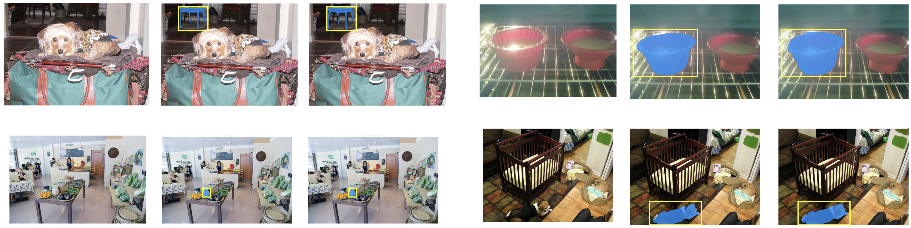

# PackESAM
## 1. Introduce

PackESAM is a library encapsulated in the form of a wheel, known as the Efficient SAM library. This distinguished library affords the execution of models via onnxruntime as well as the torch jit approach, with the capability to run on NVIDIA GPU and CPU alike. 

Should you wish to install and operate this library correctly, you are kindly advised to configure your environment in the manner described below, and to refer to the demonstration program for the development of your own applications. I wish you the utmost enjoyment in your development endeavours!

## 2. Environment Requirements

Install Pytorch and version >= 1.12.1
```shell
pip install torch==1.12.1+cu113 torchvision==0.13.1+cu113 torchaudio==0.12.1 --extra-index-url https://download.pytorch.org/whl/cu113
```

Install PackESAM
```shell
pip install ./PackESAM-1.0-py3-none-any.whl
```

It merits your attention that libraries such as `onnxruntime` and `opencv-python`, upon the installation of `PackESAM`, will automatically select the appropriate versions for installation. Furthermore, it is imperative to note that the default installation of onnxruntime is the GPU version. Should the GPU version of onnxruntime prove unfeasible to install upon your device, you are encouraged to clone this project, locally amend the configuration information concerning onnxruntime within the setup.py file, and package it anew. If it is within your means, you are also kindly requested to initiate an issue on this project, thereby enabling myself to swiftly rectify any errors that may arise within the program.

## 3. Performance
Upon rigorous testing, it has been ascertained that, when operating PackESAM in a single-threaded manner upon the machinery configured as below, utilising onnxruntime with the provider set to `CUDAExecutionProvider`, and employing the `efficientsam_ti` model, one can achieve an inference speed of 7 to 8 frames per second.

```
Processor:  Intel® Xeon(R) CPU E5-2680 v4 @ 2.40GHz × 28
Memory:     32 GiB @ 2666MHz
Graphics:   NVIDIA RTX 3060 12GB
OS:         Ubuntu 22.04 LTS 64 bit
Python:     Python 3.10
CUDA:       CUDA 11.5
```

## 4. PackESAM Instance Segmentation Examples
  |   |   |
:-------------------------:|:-------------------------:
Point-prompt | 
Box-prompt |  

## 5. Demo

```python
import cv2
from PackESAM import EfficientSAM

ESAM = EfficientSAM(mode=0, weight=0, device='cuda')

image = cv2.imread("Test_Img_1.jpg")

ESAM.set_pts(input_points=[[320, 560]], mode=0)  # [[x, y]]

while True:
    ret, [image, predicted_logits, mask, masked_image_np] = ESAM.detect(image=image)

    print(f"FPS: {1/ESAM.get_process_time()}")
    cv2.imshow("Image", masked_image_np)
    cv2.waitKey(1)
    
cv2.destroyAllWindows()
```

In the demonstration program outlined above, the structure is broadly divided into three sections:

1. Initialization of PackESAM.
2. Setting of keypoints.
3. Inference.

In the first section, during initialization, it is necessary to configure the operational mode of the entire PackESAM. When the mode is set to 0, it indicates the use of an ONNX model, whereas setting the mode to 1 signifies the employment of a JIT model. The 'weight' parameter determines the type of model being utilized: a value of 0 selects the 'ti' model, and a value of 1 opts for the 's' model. The 'device' parameter specifies the device for inference, with only ['cuda', 'cpu'] being supported options. The input must conform to the syntax specified in the aforementioned list.

In the second part, setting the keypoints, there are two modes of operation for defining keypoints. When the mode is set to 0, it is referred to as the "point prompt" mode. Under this mode, multiple keypoints can be set, with each point defined in the form of \([x, y]\) and included as an element within a larger list. This comprehensive list is then provided to `input_points`.

Conversely, when the mode is set to 1, it is known as the "box prompt" mode. In this mode, only a single pair of keypoints is allowed, representing the top-left and bottom-right corners of the detection box, respectively. Each point should be formatted as \([x, y]\) and included as part of a larger list, which is ultimately fed into `input_points`.

In the third section, which concerns inference, you are required to input an image in the np.ndarray format that conforms to the BGR color space. I strongly recommend setting the dimensions of the image within the range of 800 pixels in width by 600 pixels in height to enhance the execution speed of the program. If the inference process is correctly executed, you will receive a status value indicating that the inference state is True, along with a data packet. This packet includes the original image, `predicted_logits`, `mask`, and an np.ndarray format image in the BGR color space that has been cropped according to the mask.

It is important to note that there may be differences in the format of the `predicted_logits` and `mask` produced by the ONNX and JIT models. You should be mindful of these differences when developing your program.

## 6. Reference
Should you employ PackESAM in your research or applications, you are cordially invited to utilise the BibTeX citation provided by the original author, as a gesture of gratitude towards their scholarly contribution:

```
@article{xiong2023efficientsam,
  title={EfficientSAM: Leveraged Masked Image Pretraining for Efficient Segment Anything},
  author={Yunyang Xiong, Bala Varadarajan, Lemeng Wu, Xiaoyu Xiang, Fanyi Xiao, Chenchen Zhu, Xiaoliang Dai, Dilin Wang, Fei Sun, Forrest Iandola, Raghuraman Krishnamoorthi, Vikas Chandra},
  journal={arXiv:2312.00863},
  year={2023}
}
```


